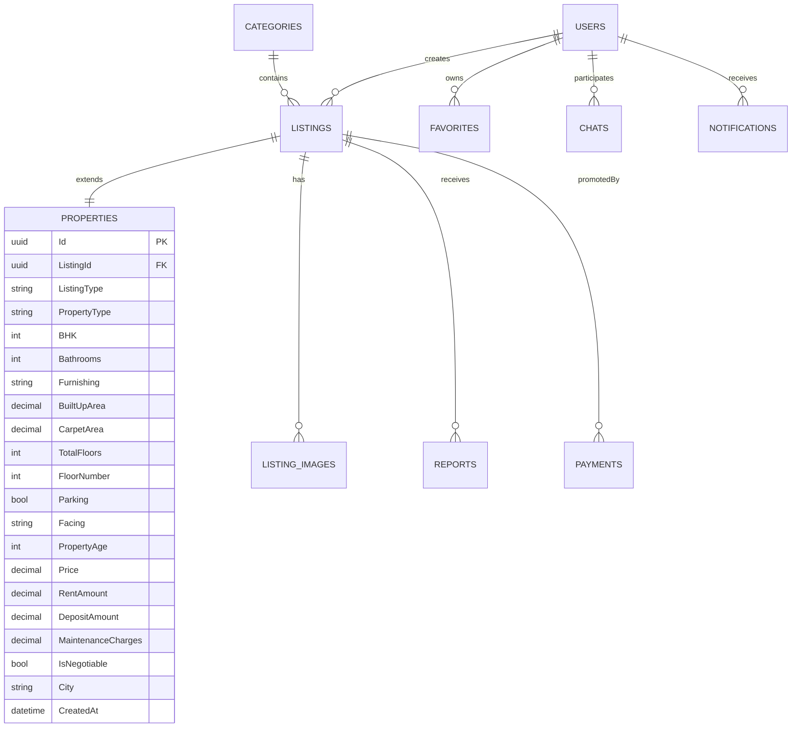

# ER Diagram Structure

```mermaid
erDiagram
    USERS ||--o{ LISTINGS : creates
    CATEGORIES ||--o{ LISTINGS : contains
    LISTINGS ||--|| PROPERTIES : extends
    LISTINGS ||--o{ LISTING_IMAGES : has
    USERS ||--o{ FAVORITES : owns
    USERS ||--o{ CHATS : participates
    LISTINGS ||--o{ REPORTS : receives
    LISTINGS ||--o{ PAYMENTS : promotedBy
    USERS ||--o{ NOTIFICATIONS : receives

    PROPERTIES {
      uuid Id PK
      uuid ListingId FK
      string ListingType
      string PropertyType
      int BHK
      int Bathrooms
      string Furnishing
      decimal BuiltUpArea
      decimal CarpetArea
      int TotalFloors
      int FloorNumber
      bool Parking
      string Facing
      int PropertyAge
      decimal Price
      decimal RentAmount
      decimal DepositAmount
      decimal MaintenanceCharges
      bool IsNegotiable
      string City
      datetime CreatedAt
    }
```
