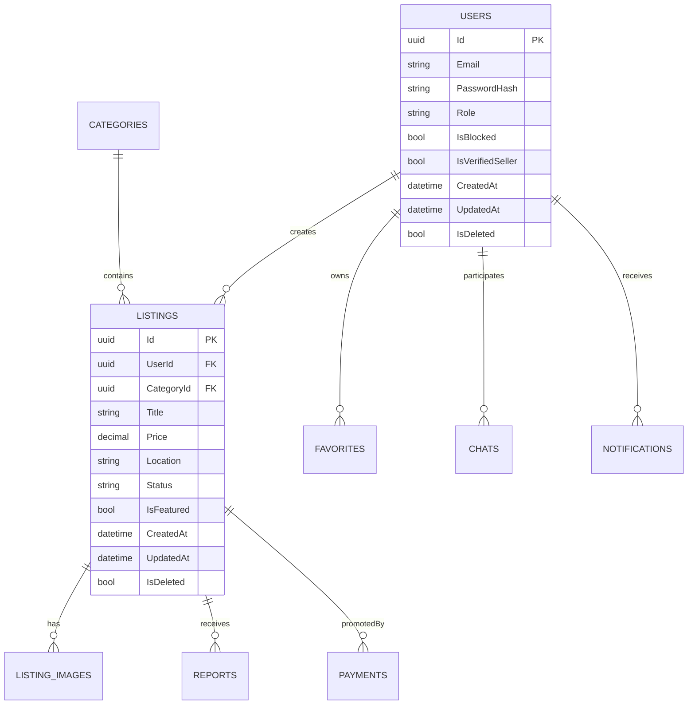

# ER Diagram Structure

```mermaid
erDiagram
    USERS ||--o{ LISTINGS : creates
    USERS ||--o{ FAVORITES : owns
    USERS ||--o{ CHATS : participates
    CATEGORIES ||--o{ LISTINGS : contains
    LISTINGS ||--o{ LISTING_IMAGES : has
    LISTINGS ||--o{ REPORTS : receives
    LISTINGS ||--o{ PAYMENTS : promotedBy
    USERS ||--o{ NOTIFICATIONS : receives

    USERS {
      uuid Id PK
      string Email
      string PasswordHash
      string Role
      bool IsBlocked
      bool IsVerifiedSeller
      datetime CreatedAt
      datetime UpdatedAt
      bool IsDeleted
    }

    LISTINGS {
      uuid Id PK
      uuid UserId FK
      uuid CategoryId FK
      string Title
      decimal Price
      string Location
      string Status
      bool IsFeatured
      datetime CreatedAt
      datetime UpdatedAt
      bool IsDeleted
    }
```
